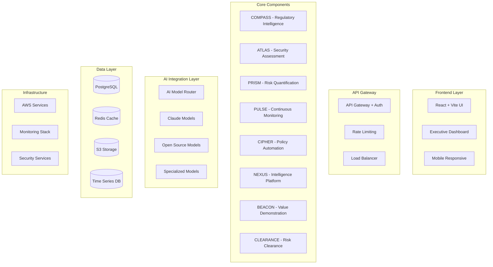

# ERIP Platform Architecture
## Complete Technical Architecture for Enterprise Risk Intelligence Platform

---

## 1. System Overview

### High-Level Architecture



---

## 2. Technology Stack

### Core Technologies

```typescript
interface TechnologyStack {
  frontend: {
    framework: "Vite 5.0 + React 18.2";
    ui_library: "shadcn/ui + Tailwind CSS 3.4";
    state_management: "Zustand 4.5";
    routing: "React Router 6.22";
    forms: "React Hook Form + Zod";
    charts: "Recharts + D3.js";
    testing: "Vitest + React Testing Library";
  };
  
  backend: {
    runtime: "Node.js 20 LTS";
    framework: "Express.js + tRPC";
    orm: "Prisma 5.8";
    validation: "Zod";
    authentication: "Auth.js (NextAuth)";
    api_docs: "OpenAPI 3.0";
    testing: "Jest + Supertest";
  };
  
  ai_integration: {
    premium_models: ["Claude-3-Opus", "Claude-3-Sonnet", "Claude-3-Haiku"];
    open_source: ["Llama-3.1-70B", "Mistral-7B", "Phi-3-Mini"];
    specialized: ["FinBERT", "SecBERT", "LegalBERT"];
    frameworks: ["LangChain", "LlamaIndex", "vLLM"];
  };
  
  infrastructure: {
    cloud: "AWS";
    container: "Docker + Kubernetes";
    ci_cd: "GitHub Actions + AWS CodePipeline";
    monitoring: "Prometheus + Grafana + CloudWatch";
    logging: "ELK Stack + CloudWatch Logs";
    security: "AWS WAF + GuardDuty + Security Hub";
  };
}
```

---

## 3. Component Architecture

### 3.1 COMPASS - Regulatory Intelligence Engine

```typescript
interface COMPASSArchitecture {
  api_endpoints: {
    "/api/compass/regulations": "List and search regulations";
    "/api/compass/analyze": "AI-powered regulation analysis";
    "/api/compass/requirements": "Extract compliance requirements";
    "/api/compass/frameworks": "Manage compliance frameworks";
    "/api/compass/monitoring": "Monitor regulatory changes";
  };
  
  services: {
    RegulationAnalysisService: {
      primary_model: "Claude-3-Sonnet";
      batch_processing: "Llama-3.1-70B";
      classification: "Mistral-7B";
      specialized: "LegalBERT";
    };
    
    FrameworkMappingService: {
      cross_reference: "Graph database for relationships";
      gap_analysis: "AI-powered gap identification";
      priority_scoring: "ML-based prioritization";
    };
    
    MonitoringService: {
      sources: ["EUR-Lex", "Federal Register", "ISO", "Academic APIs"];
      change_detection: "Phi-3-Mini for efficient monitoring";
      alerting: "Real-time notification system";
    };
  };
  
  data_models: {
    Regulation: {
      id: "uuid";
      title: "string";
      body: "text";
      jurisdiction: "string";
      effective_date: "date";
      requirements: "Requirement[]";
      ai_analysis: "json";
    };
    
    ComplianceFramework: {
      id: "uuid";
      name: "string";
      version: "string";
      controls: "Control[]";
      mappings: "FrameworkMapping[]";
    };
  };
}
```

### 3.2 ATLAS - Security Assessment System

```typescript
interface ATLASArchitecture {
  api_endpoints: {
    "/api/atlas/assessments": "Manage security assessments";
    "/api/atlas/findings": "Security findings and analysis";
    "/api/atlas/controls": "Control effectiveness monitoring";
    "/api/atlas/remediation": "Remediation recommendations";
    "/api/atlas/third-party": "Third-party risk assessment";
  };
  
  services: {
    AssessmentService: {
      integrations: ["Security tools", "AWS Security Hub", "Azure Defender"];
      analysis_model: "Claude-3-Sonnet";
      classification: "SecBERT";
      risk_scoring: "Custom ML model";
    };
    
    FindingsAnalysisService: {
      technical_analysis: "Code-Llama-34B";
      business_context: "Claude-3-Sonnet";
      prioritization: "Risk-based scoring algorithm";
      deduplication: "ML-based similarity detection";
    };
    
    RemediationService: {
      recommendation_engine: "Claude-3-Opus";
      automation_scripts: "Infrastructure as Code generation";
      validation: "Automated testing framework";
    };
  };
  
  data_models: {
    Assessment: {
      id: "uuid";
      type: "enum";
      status: "enum";
      findings: "Finding[]";
      risk_score: "number";
      recommendations: "Recommendation[]";
    };
    
    Finding: {
      id: "uuid";
      severity: "enum";
      category: "string";
      description: "text";
      technical_details: "json";
      business_impact: "text";
      remediation: "Remediation";
    };
  };
}
```

### 3.3 PRISM - Risk Quantification Engine

```typescript
interface PRISMArchitecture {
  api_endpoints: {
    "/api/prism/quantify": "Quantify risk in financial terms";
    "/api/prism/scenarios": "Risk scenario modeling";
    "/api/prism/monte-carlo": "Monte Carlo simulations";
    "/api/prism/roi": "Security investment ROI analysis";
    "/api/prism/reports": "Executive risk reports";
  };
  
  services: {
    QuantificationService: {
      methodology: "FAIR";
      setup_model: "Claude-3-Haiku";
      calculations: "NumPy/SciPy (Python microservice)";
      financial_analysis: "FinBERT";
      reporting: "Claude-3-Sonnet";
    };
    
    SimulationService: {
      engine: "Python Monte Carlo engine";
      parameters: "AI-assisted parameter estimation";
      validation: "Historical data backtesting";
      visualization: "D3.js interactive charts";
    };
    
    ROIService: {
      cost_modeling: "Activity-based costing";
      benefit_calculation: "Risk reduction quantification";
      optimization: "Portfolio optimization algorithms";
      reporting: "Executive dashboard integration";
    };
  };
  
  data_models: {
    RiskScenario: {
      id: "uuid";
      name: "string";
      threat_event: "ThreatEvent";
      asset_value: "number";
      loss_magnitude: "Distribution";
      frequency: "Distribution";
      calculated_risk: "number";
    };
    
    MonteCarloResult: {
      id: "uuid";
      scenario_id: "uuid";
      iterations: "number";
      results: "SimulationResult[]";
      statistics: "Statistics";
      confidence_intervals: "ConfidenceInterval[]";
    };
  };
}
```

### 3.4 PULSE - Continuous Monitoring System

```typescript
interface PULSEArchitecture {
  api_endpoints: {
    "/api/pulse/monitor": "Real-time monitoring data";
    "/api/pulse/alerts": "Alert management";
    "/api/pulse/kris": "Key Risk Indicators";
    "/api/pulse/predictions": "Predictive analytics";
    "/api/pulse/dashboard": "Monitoring dashboard data";
  };
  
  services: {
    MonitoringService: {
      data_collection: "Event streaming (Kinesis)";
      change_detection: "Phi-3-Mini";
      anomaly_detection: "Custom ML models";
      correlation: "Graph-based analysis";
    };
    
    AlertingService: {
      intelligent_routing: "Context-aware routing";
      deduplication: "ML-based grouping";
      prioritization: "Business impact scoring";
      escalation: "Automated workflows";
    };
    
    PredictiveService: {
      trend_analysis: "Time series forecasting";
      risk_prediction: "Claude-3-Opus";
      early_warning: "Statistical models";
      recommendations: "AI-powered insights";
    };
  };
  
  data_models: {
    MonitoringEvent: {
      id: "uuid";
      timestamp: "datetime";
      source: "string";
      type: "enum";
      data: "json";
      severity: "enum";
      processed: "boolean";
    };
    
    Alert: {
      id: "uuid";
      triggered_at: "datetime";
      type: "enum";
      severity: "enum";
      context: "json";
      assigned_to: "User";
      status: "enum";
      resolution: "Resolution";
    };
  };
}
```

### 3.5 CIPHER - Policy Automation Engine

```typescript
interface CIPHERArchitecture {
  api_endpoints: {
    "/api/cipher/policies": "Policy management";
    "/api/cipher/generate": "AI policy generation";
    "/api/cipher/validate": "Policy validation";
    "/api/cipher/deploy": "Policy deployment";
    "/api/cipher/compliance": "Compliance checking";
  };
  
  services: {
    PolicyGenerationService: {
      generation_model: "Claude-3-Sonnet";
      templates: "Industry-specific templates";
      customization: "Organization-specific rules";
      validation: "Policy coherence checking";
    };
    
    DeploymentService: {
      iac_generation: "Terraform/CloudFormation";
      testing: "Policy testing framework";
      rollback: "Automated rollback capability";
      monitoring: "Deployment tracking";
    };
    
    ComplianceService: {
      continuous_checking: "Real-time validation";
      drift_detection: "Configuration monitoring";
      reporting: "Compliance dashboards";
      remediation: "Automated fixes";
    };
  };
  
  data_models: {
    Policy: {
      id: "uuid";
      name: "string";
      version: "string";
      content: "text";
      type: "enum";
      status: "enum";
      deployments: "Deployment[]";
      compliance_checks: "ComplianceCheck[]";
    };
    
    Deployment: {
      id: "uuid";
      policy_id: "uuid";
      environment: "string";
      status: "enum";
      deployed_at: "datetime";
      configuration: "json";
    };
  };
}
```

### 3.6 NEXUS - Advanced Intelligence Platform

```typescript
interface NEXUSArchitecture {
  api_endpoints: {
    "/api/nexus/intelligence": "Threat intelligence data";
    "/api/nexus/research": "Research integration";
    "/api/nexus/benchmarks": "Industry benchmarking";
    "/api/nexus/forecasting": "Regulatory forecasting";
    "/api/nexus/collaboration": "Expert network";
  };
  
  services: {
    IntelligenceService: {
      threat_feeds: ["Commercial", "Open Source", "Government"];
      analysis_model: "Claude-3-Opus";
      correlation: "Graph analytics";
      enrichment: "Multi-source aggregation";
    };
    
    ResearchService: {
      academic_apis: ["Semantic Scholar", "Consensus"];
      analysis: "Claude-3-Sonnet";
      summarization: "Llama-3.1-70B";
      relevance_scoring: "Custom ML model";
    };
    
    BenchmarkingService: {
      data_collection: "Industry surveys";
      anonymization: "Privacy-preserving analytics";
      comparison: "Statistical analysis";
      insights: "AI-generated recommendations";
    };
  };
  
  data_models: {
    ThreatIntelligence: {
      id: "uuid";
      source: "string";
      type: "enum";
      indicators: "Indicator[]";
      analysis: "json";
      relevance_score: "number";
      last_updated: "datetime";
    };
    
    Research: {
      id: "uuid";
      title: "string";
      source: "string";
      abstract: "text";
      relevance: "number";
      key_findings: "string[]";
      implications: "text";
    };
  };
}
```

### 3.7 BEACON - Value Demonstration Platform

```typescript
interface BEACONArchitecture {
  api_endpoints: {
    "/api/beacon/metrics": "Value metrics tracking";
    "/api/beacon/roi": "ROI calculations";
    "/api/beacon/reports": "Business impact reports";
    "/api/beacon/maturity": "Maturity assessments";
    "/api/beacon/stories": "Success story generation";
  };
  
  services: {
    MetricsService: {
      data_collection: "Cross-component aggregation";
      calculation: "Financial modeling";
      tracking: "Time series analysis";
      validation: "Data quality checks";
    };
    
    ReportingService: {
      generation_model: "Claude-3-Sonnet";
      visualization: "D3.js + Recharts";
      customization: "Template engine";
      distribution: "Automated delivery";
    };
    
    MaturityService: {
      assessment_framework: "Industry standards";
      scoring: "Multi-dimensional analysis";
      recommendations: "AI-powered insights";
      tracking: "Progress monitoring";
    };
  };
  
  data_models: {
    ValueMetric: {
      id: "uuid";
      type: "enum";
      value: "number";
      timestamp: "datetime";
      component: "string";
      calculation_method: "string";
      validated: "boolean";
    };
    
    ROIReport: {
      id: "uuid";
      period: "DateRange";
      costs: "Cost[]";
      benefits: "Benefit[]";
      roi_percentage: "number";
      payback_period: "number";
      executive_summary: "text";
    };
  };
}
```

### 3.8 CLEARANCE - Strategic Risk Clearance Platform with Risk Appetite Automation

```typescript
interface CLEARANCEArchitecture {
  api_endpoints: {
    "/api/clearance/risks": "Risk submission and tracking";
    "/api/clearance/quantify": "Financial impact calculation";
    "/api/clearance/routing": "Approval routing";
    "/api/clearance/decisions": "Decision management";
    "/api/clearance/analytics": "Decision analytics";
    "/api/clearance/appetite": "Risk appetite automation";
    "/api/clearance/thresholds": "Dynamic threshold management";
    "/api/clearance/scenarios": "Loss scenario modeling";
  };
  
  services: {
    RiskQuantificationService: {
      financial_modeling: "FinBERT + Custom models";
      impact_calculation: "Monte Carlo engine";
      opportunity_analysis: "Claude-3-Sonnet";
      confidence_scoring: "Statistical analysis";
    };
    
    RiskAppetiteAutomationService: {
      appetite_definition: {
        loss_scenario_modeling: "AI-powered scenario generation from ATLAS";
        magnitude_thresholds: "PRISM Monte Carlo dynamic calculation";
        probability_thresholds: "Statistical analysis with confidence intervals";
        business_context: "Claude-3-Sonnet risk vs opportunity analysis";
      };
      
      threshold_management: {
        dynamic_calculation: "Revenue-adjusted thresholds";
        market_impact: "Public company market cap considerations";
        cash_flow_analysis: "Operational impact modeling";
        insurance_coordination: "Coverage alignment automation";
      };
      
      crown_jewels_identification: {
        automated_discovery: "ATLAS integration for asset criticality";
        business_impact_scoring: "AI-powered importance ranking";
        revenue_mapping: "Financial impact per asset";
        continuous_updates: "Dynamic re-prioritization";
      };
      
      monitoring: {
        real_time_tracking: "PULSE continuous appetite monitoring";
        behavioral_alerts: "Automated threshold approach warnings";
        trend_analysis: "Risk appetite trajectory modeling";
        compliance_tracking: "Adherence to defined appetite";
      };
    };
    
    RoutingService: {
      authority_mapping: "Organization hierarchy integration";
      rules_engine: "Business rules processing";
      risk_appetite_routing: "Threshold-based approval levels";
      escalation: "Automated escalation logic";
      notifications: "Multi-channel alerts";
    };
    
    DecisionIntelligenceService: {
      precedent_analysis: "Historical decision mining";
      recommendation: "Claude-3-Opus";
      outcome_tracking: "Decision effectiveness";
      learning: "Continuous improvement ML";
      appetite_optimization: "Threshold refinement based on outcomes";
    };
  };
  
  data_models: {
    RiskClearanceRequest: {
      id: "uuid";
      risk_description: "text";
      financial_impact: "FinancialImpact";
      opportunity_value: "number";
      requester: "User";
      status: "enum";
      decision: "Decision";
      approval_chain: "Approval[]";
      appetite_assessment: "AppetiteAssessment";
    };
    
    RiskAppetite: {
      id: "uuid";
      organization_id: "uuid";
      loss_scenarios: "LossScenario[]";
      magnitude_thresholds: "MagnitudeThreshold[]";
      probability_thresholds: "ProbabilityThreshold[]";
      crown_jewels: "CrownJewel[]";
      decision_boundaries: "DecisionBoundary[]";
      kris: "KeyRiskIndicator[]";
      last_updated: "datetime";
      ai_recommendations: "json";
    };
    
    LossScenario: {
      id: "uuid";
      name: "string";
      category: "enum"; // ransomware, data_breach, outage, supply_chain
      automated_modeling: "json";
      business_impact: "FinancialImpact";
      probability: "Distribution";
      mitigation_strategies: "Strategy[]";
    };
    
    Decision: {
      id: "uuid";
      request_id: "uuid";
      decision_type: "enum";
      rationale: "text";
      conditions: "string[]";
      decided_by: "User";
      decided_at: "datetime";
      outcome_tracking: "Outcome[]";
      appetite_alignment: "AppetiteAlignment";
    };
  };
  
  automation_benefits: {
    time_reduction: "6-month projects → 30-day automation";
    accuracy_improvement: "AI-powered vs manual assessment";
    continuous_monitoring: "Real-time vs periodic reviews";
    roi: "300-500% first-year returns";
    strategic_enablement: "Transform risk from blocker to enabler";
  };
}
```

---

## 4. AI Integration Architecture

### 4.1 Model Routing Strategy

```typescript
interface AIModelRouter {
  routing_logic: {
    complexity_assessment: {
      simple: ["Phi-3-Mini", "Mistral-7B"];
      medium: ["Claude-3-Haiku", "Llama-3.1-70B"];
      complex: ["Claude-3-Sonnet", "Claude-3-Opus"];
    };
    
    task_type_routing: {
      classification: ["Mistral-7B", "DistilBERT"];
      generation: ["Claude-3-Sonnet", "Llama-3.1-70B"];
      analysis: ["Claude-3-Opus", "Claude-3-Sonnet"];
      extraction: ["Phi-3-Mini", "Mistral-7B"];
    };
    
    cost_optimization: {
      batch_processing: "Open source models preferred";
      real_time: "Balance between cost and latency";
      critical_path: "Premium models for accuracy";
    };
  };
  
  implementation: {
    primary_router: "AI service with intelligent routing";
    fallback_mechanism: "Graceful degradation to lower tier";
    caching_strategy: "Redis for repeated queries";
    monitoring: "Cost and performance tracking";
  };
}
```

### 4.2 Open Source Model Deployment

```typescript
interface OpenSourceDeployment {
  infrastructure: {
    compute: {
      gpu_instances: "AWS EC2 G5 instances";
      container_orchestration: "Kubernetes with GPU support";
      scaling: "Horizontal pod autoscaling";
    };
    
    model_serving: {
      framework: "vLLM for high throughput";
      api_layer: "FastAPI with async support";
      load_balancing: "Model-aware routing";
    };
    
    optimization: {
      quantization: "8-bit and 4-bit quantization";
      batching: "Dynamic batching for efficiency";
      caching: "KV cache optimization";
    };
  };
  
  deployment_options: {
    cloud_hosted: "AWS SageMaker endpoints";
    self_hosted: "Kubernetes cluster";
    edge_deployment: "Customer premises option";
    hybrid: "Mix of cloud and on-premises";
  };
}
```

---

## 5. Data Architecture

### 5.1 Database Schema Design

```typescript
interface DatabaseArchitecture {
  primary_database: {
    type: "PostgreSQL 15";
    schema_management: "Prisma ORM";
    partitioning: "Time-based for large tables";
    replication: "Read replicas for scaling";
  };
  
  caching_layer: {
    type: "Redis 7";
    use_cases: [
      "Session management",
      "AI response caching",
      "Real-time data",
      "Rate limiting"
    ];
    persistence: "AOF for critical data";
  };
  
  time_series_data: {
    type: "AWS Timestream";
    use_cases: [
      "Monitoring metrics",
      "Risk indicators",
      "Performance data"
    ];
    retention: "Automated lifecycle policies";
  };
  
  document_storage: {
    type: "S3 + OpenSearch";
    use_cases: [
      "Compliance documents",
      "Reports",
      "Evidence files"
    ];
    indexing: "Full-text search capability";
  };
}
```

### 5.2 Data Flow Architecture

```typescript
interface DataFlowArchitecture {
  ingestion: {
    streaming: {
      service: "AWS Kinesis Data Streams";
      processing: "Lambda functions";
      destinations: ["PostgreSQL", "Timestream", "S3"];
    };
    
    batch: {
      service: "AWS Batch";
      scheduling: "EventBridge rules";
      processing: "ECS tasks";
    };
  };
  
  processing: {
    real_time: {
      framework: "Apache Flink on EMR";
      use_cases: ["Anomaly detection", "Alert generation"];
    };
    
    batch_analytics: {
      framework: "Apache Spark on EMR";
      use_cases: ["Risk calculations", "Report generation"];
    };
  };
  
  integration: {
    event_bus: "AWS EventBridge";
    api_gateway: "AWS API Gateway";
    webhooks: "Custom webhook service";
    file_transfer: "AWS Transfer Family";
  };
}
```

---

## 6. Security Architecture

### 6.1 Security Controls

```typescript
interface SecurityArchitecture {
  authentication: {
    provider: "Auth.js with multiple providers";
    methods: ["SAML", "OAuth2", "MFA"];
    session_management: "JWT with refresh tokens";
    rbac: "Role-based access control";
  };
  
  encryption: {
    at_rest: "AWS KMS customer managed keys";
    in_transit: "TLS 1.3 minimum";
    field_level: "Application-level encryption";
    key_rotation: "Automated 90-day rotation";
  };
  
  network_security: {
    waf: "AWS WAF with custom rules";
    ddos_protection: "AWS Shield Advanced";
    vpc: "Private subnets with NAT gateways";
    segmentation: "Microsegmentation with security groups";
  };
  
  compliance: {
    standards: ["SOC 2", "ISO 27001", "GDPR"];
    logging: "CloudTrail + custom audit logs";
    monitoring: "GuardDuty + Security Hub";
    scanning: "Container and dependency scanning";
  };
}
```

### 6.2 Data Privacy

```typescript
interface DataPrivacyArchitecture {
  data_classification: {
    levels: ["Public", "Internal", "Confidential", "Restricted"];
    tagging: "Automated data classification";
    handling: "Level-appropriate controls";
  };
  
  privacy_controls: {
    anonymization: "PII removal and masking";
    pseudonymization: "Reversible data protection";
    retention: "Automated data lifecycle";
    portability: "GDPR export capabilities";
  };
  
  access_controls: {
    least_privilege: "Minimal access by default";
    segregation: "Customer data isolation";
    audit: "Complete access logging";
    review: "Quarterly access reviews";
  };
}
```

---

## 7. Deployment Architecture

### 7.1 Infrastructure as Code

```typescript
interface IaCArchitecture {
  framework: "Terraform + AWS CDK";
  
  modules: {
    networking: "VPC, subnets, security groups";
    compute: "ECS, Lambda, EC2";
    storage: "RDS, S3, DynamoDB";
    ai_infrastructure: "SageMaker, GPU instances";
  };
  
  environments: {
    development: "Single region, minimal redundancy";
    staging: "Production-like, reduced scale";
    production: "Multi-region, full redundancy";
  };
  
  ci_cd: {
    pipeline: "GitHub Actions + AWS CodePipeline";
    testing: "Automated testing at each stage";
    deployment: "Blue-green deployments";
    rollback: "Automated rollback capability";
  };
}
```

### 7.2 Monitoring and Observability

```typescript
interface ObservabilityArchitecture {
  metrics: {
    collection: "Prometheus + CloudWatch";
    storage: "Prometheus TSDB + CloudWatch Metrics";
    visualization: "Grafana dashboards";
    alerting: "PagerDuty integration";
  };
  
  logging: {
    aggregation: "ELK stack (Elasticsearch, Logstash, Kibana)";
    structured_logging: "JSON format with correlation IDs";
    retention: "30 days hot, 1 year cold storage";
    analysis: "Log Insights + custom queries";
  };
  
  tracing: {
    framework: "OpenTelemetry";
    backend: "AWS X-Ray + Jaeger";
    sampling: "Adaptive sampling strategy";
    analysis: "Performance bottleneck identification";
  };
  
  slos: {
    availability: "99.9% uptime";
    latency: "p95 < 2 seconds";
    error_rate: "< 0.1%";
    monitoring: "SLO dashboards and alerts";
  };
}
```

---

## 8. Scalability Design

### 8.1 Horizontal Scaling

```typescript
interface ScalabilityArchitecture {
  application_tier: {
    containerization: "Docker containers";
    orchestration: "ECS with Fargate";
    auto_scaling: "Target tracking policies";
    load_balancing: "Application Load Balancer";
  };
  
  database_tier: {
    read_scaling: "Aurora read replicas";
    write_scaling: "Sharding strategy";
    caching: "Redis cluster mode";
    connection_pooling: "PgBouncer";
  };
  
  ai_model_scaling: {
    inference_endpoints: "SageMaker multi-model endpoints";
    batch_processing: "Step Functions + Lambda";
    gpu_scaling: "Spot instances for batch work";
    edge_caching: "Model results caching";
  };
  
  global_scale: {
    cdn: "CloudFront for static assets";
    multi_region: "Active-active deployment";
    data_replication: "Cross-region replication";
    traffic_routing: "Route 53 geolocation";
  };
}
```

---

## 9. Integration Architecture

### 9.1 External Integrations

```typescript
interface IntegrationArchitecture {
  security_tools: {
    prowler: {
      method: "REST API + Webhook";
      data_sync: "Scheduled + real-time";
      authentication: "API key + OAuth";
    };
    cloud_providers: {
      aws: "Native SDK integration";
      azure: "REST API";
      gcp: "Client libraries";
    };
  };
  
  regulatory_sources: {
    apis: {
      eur_lex: "REST API with rate limiting";
      federal_register: "Bulk download + API";
      standards_bodies: "Subscription feeds";
    };
    scraping: {
      framework: "Scrapy + Selenium";
      scheduling: "Airflow pipelines";
      storage: "S3 + metadata in PostgreSQL";
    };
  };
  
  enterprise_systems: {
    identity: {
      protocols: ["SAML 2.0", "OAuth 2.0", "OIDC"];
      providers: ["Okta", "Azure AD", "Auth0"];
    };
    communication: {
      channels: ["Slack", "Teams", "Email"];
      webhooks: "Outbound notifications";
      apis: "Bidirectional integration";
    };
  };
}
```

---

## 10. Performance Architecture

### 10.1 Performance Optimization

```typescript
interface PerformanceArchitecture {
  frontend_optimization: {
    bundling: "Vite with code splitting";
    lazy_loading: "Route-based splitting";
    caching: "Service worker + HTTP caching";
    cdn: "CloudFront distribution";
  };
  
  backend_optimization: {
    query_optimization: "Database indexing strategy";
    caching_strategy: "Multi-layer caching";
    connection_pooling: "Optimized pool sizes";
    async_processing: "Queue-based architecture";
  };
  
  ai_optimization: {
    model_caching: "Warm model instances";
    batch_inference: "Request batching";
    result_caching: "Semantic caching";
    model_optimization: "Quantization + pruning";
  };
  
  targets: {
    page_load: "< 3 seconds initial load";
    api_response: "< 2 seconds p95";
    ai_inference: "< 5 seconds complex analysis";
    throughput: "10K requests/second";
  };
}
```

---

## Conclusion

This architecture provides a comprehensive, scalable, and secure foundation for the ERIP platform. It incorporates:

1. **Modular component design** for all 8 core components
2. **Hybrid AI integration** with cost optimization
3. **Enterprise-grade security** and compliance
4. **Scalable infrastructure** for global deployment
5. **Comprehensive monitoring** and observability
6. **Performance optimization** at every layer

The architecture is designed to support rapid development while maintaining production-grade quality and the ability to scale to thousands of enterprise customers.