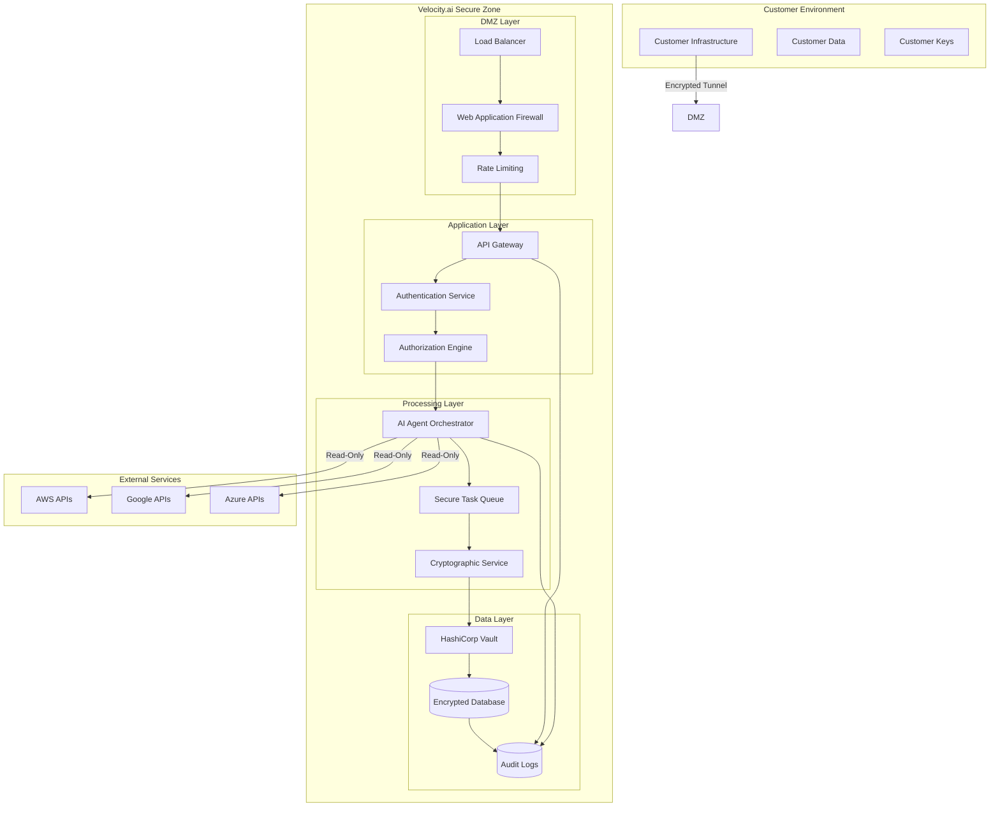

# Velocity.ai Security-First Architecture

## 🔒 **Core Security Principles**

### **Trust Through Transparency**
- **Open Source Security**: All security implementations are open source and auditable
- **Public Security Documentation**: This document and our security practices are publicly available
- **Transparent Audit Logs**: Every action is logged and accessible to customers
- **No Hidden Processes**: All AI agent activities are visible and explainable

### **Zero Trust Architecture**
- **Assume Breach**: Design assumes eventual compromise and limits blast radius
- **Least Privilege**: Every component has minimum required permissions
- **Continuous Verification**: All access is continuously verified and validated
- **Network Segmentation**: Critical components are isolated and protected

### **Customer Data Sovereignty**
- **Customer-Controlled Encryption**: Customers maintain their own encryption keys
- **Data Residency**: Customer data stays in customer-chosen regions
- **No Cross-Customer Data**: Strict isolation between customer environments
- **Customer-Owned Infrastructure**: Option for deployment in customer VPCs

---

## 🛡️ **Security Architecture Overview**



---

## 🔐 **Encryption & Key Management**

### **Encryption at Every Layer**
```typescript
interface EncryptionArchitecture {
  data_at_rest: {
    database: "AES-256 with customer-managed keys",
    files: "AES-256-GCM with per-file keys",
    backups: "AES-256 with separate backup keys",
    logs: "AES-256 with log-specific keys"
  },
  
  data_in_transit: {
    external_apis: "TLS 1.3 with certificate pinning",
    internal_services: "mTLS with service certificates",
    customer_connections: "TLS 1.3 + client certificates",
    agent_communications: "End-to-end encrypted channels"
  },
  
  data_in_processing: {
    memory_protection: "Encrypted memory regions",
    cpu_security: "Intel SGX enclaves for sensitive operations",
    key_derivation: "PBKDF2 with customer salt",
    secure_deletion: "Cryptographic erasure of keys"
  }
}
```

### **Customer-Controlled Key Management**
- **Customer Root Keys**: Customers generate and control root encryption keys
- **Key Escrow**: Optional key escrow with customer-chosen trustees
- **Hardware Security Modules**: Integration with customer HSMs
- **Key Rotation**: Automated key rotation with customer approval

### **HashiCorp Vault Integration**
```yaml
vault_configuration:
  auth_methods:
    - kubernetes_service_accounts
    - jwt_tokens_with_rbac
    - certificate_based_auth
  
  secret_engines:
    - database_credentials_rotation
    - customer_api_keys
    - encryption_key_management
    - certificate_authority
  
  policies:
    - least_privilege_by_service
    - time_limited_tokens
    - ip_address_restrictions
    - audit_trail_requirements
```

---

## 🔍 **Authentication & Authorization**

### **Multi-Factor Authentication**
```python
class VelocityMFASystem:
    def __init__(self):
        self.required_factors = {
            "admin_users": 3,  # Something you know, have, are
            "regular_users": 2,  # Something you know, have
            "service_accounts": 2,  # Certificate + API key
            "ai_agents": 2  # Service certificate + JWT
        }
    
    def authenticate_user(self, user_id: str, factors: List[AuthFactor]) -> AuthResult:
        """Multi-factor authentication with adaptive risk scoring"""
        risk_score = self.calculate_risk_score(user_id, factors)
        required_factors = self.get_required_factors(user_id, risk_score)
        
        if len(factors) >= required_factors:
            return self.create_limited_session(user_id, risk_score)
        else:
            return AuthResult.INSUFFICIENT_FACTORS
    
    def calculate_risk_score(self, user_id: str, factors: List[AuthFactor]) -> int:
        """AI-powered risk scoring based on behavior patterns"""
        return RiskAnalysisEngine.calculate_user_risk(
            user_id=user_id,
            location=factors.get_location(),
            device=factors.get_device(),
            time_pattern=factors.get_timing(),
            historical_behavior=self.get_user_history(user_id)
        )
```

### **Role-Based Access Control (RBAC)**
```python
class VelocityRBAC:
    """Hierarchical RBAC with fine-grained permissions"""
    
    ROLES = {
        "super_admin": {
            "permissions": ["*"],
            "constraints": ["mfa_required", "ip_restricted", "time_limited"]
        },
        "org_admin": {
            "permissions": [
                "user.create", "user.delete", "user.modify",
                "agent.configure", "agent.monitor",
                "compliance.view", "compliance.export"
            ],
            "constraints": ["mfa_required", "audit_logged"]
        },
        "compliance_officer": {
            "permissions": [
                "compliance.view", "compliance.export", "compliance.report",
                "agent.monitor", "evidence.review", "audit.access"
            ],
            "constraints": ["mfa_required", "audit_logged"]
        },
        "developer": {
            "permissions": [
                "agent.configure", "integration.test", "sandbox.access",
                "api.read", "logs.view"
            ],
            "constraints": ["mfa_required", "sandbox_only"]
        },
        "viewer": {
            "permissions": [
                "dashboard.view", "reports.view", "compliance.view"
            ],
            "constraints": ["session_timeout_30min"]
        }
    }
    
    def check_permission(self, user_id: str, action: str, resource: str) -> bool:
        """Check if user has permission for specific action on resource"""
        user_roles = self.get_user_roles(user_id)
        user_constraints = self.get_active_constraints(user_id)
        
        # Check if any role grants the permission
        for role in user_roles:
            if self.role_grants_permission(role, action, resource):
                # Verify all constraints are satisfied
                if self.verify_constraints(user_id, user_constraints):
                    self.log_access_decision(user_id, action, resource, True)
                    return True
        
        self.log_access_decision(user_id, action, resource, False)
        return False
```

---

## 🤖 **AI Agent Security**

### **Secure AI Agent Architecture**
```python
class SecureAIAgent:
    """Security-first AI agents with comprehensive monitoring"""
    
    def __init__(self, agent_id: str, capabilities: List[str]):
        self.agent_id = agent_id
        self.capabilities = capabilities
        self.security_context = self.initialize_security_context()
        self.audit_logger = AuditLogger(agent_id)
    
    def initialize_security_context(self) -> SecurityContext:
        """Initialize secure execution context for agent"""
        return SecurityContext(
            agent_id=self.agent_id,
            allowed_capabilities=self.capabilities,
            network_restrictions=self.get_network_policy(),
            resource_limits=self.get_resource_limits(),
            encryption_keys=self.get_agent_keys()
        )
    
    async def execute_task(self, task: Task) -> TaskResult:
        """Execute task with comprehensive security controls"""
        # Pre-execution security checks
        if not self.validate_task_security(task):
            raise SecurityException("Task failed security validation")
        
        # Create isolated execution environment
        execution_env = self.create_secure_environment()
        
        try:
            # Log task start
            self.audit_logger.log_task_start(task)
            
            # Execute with monitoring
            result = await self.execute_with_monitoring(task, execution_env)
            
            # Validate result security
            self.validate_result_security(result)
            
            # Log successful completion
            self.audit_logger.log_task_success(task, result)
            
            return result
            
        except Exception as e:
            # Log failure and security implications
            self.audit_logger.log_task_failure(task, e)
            self.security_incident_handler.report_agent_error(self.agent_id, task, e)
            raise
        
        finally:
            # Clean up secure environment
            execution_env.cleanup()
    
    def validate_task_security(self, task: Task) -> bool:
        """Comprehensive task security validation"""
        validations = [
            self.check_capability_permissions(task),
            self.validate_data_access_scope(task),
            self.check_network_restrictions(task),
            self.validate_resource_requirements(task),
            self.check_time_constraints(task)
        ]
        
        return all(validations)
```

### **Agent Communication Security**
```python
class SecureAgentCommunication:
    """End-to-end encrypted agent communication"""
    
    def __init__(self):
        self.message_bus = EncryptedMessageBus()
        self.identity_manager = AgentIdentityManager()
        self.message_validator = MessageValidator()
    
    async def send_message(
        self, 
        sender_agent: str, 
        recipient_agent: str, 
        message: Dict
    ) -> None:
        """Send encrypted message between agents"""
        
        # Validate sender identity
        if not self.identity_manager.validate_agent_identity(sender_agent):
            raise SecurityException("Invalid sender identity")
        
        # Get recipient public key
        recipient_key = self.identity_manager.get_agent_public_key(recipient_agent)
        
        # Encrypt message
        encrypted_message = self.encrypt_message(message, recipient_key)
        
        # Add integrity protection
        signed_message = self.sign_message(encrypted_message, sender_agent)
        
        # Send through secure channel
        await self.message_bus.send(
            sender=sender_agent,
            recipient=recipient_agent,
            message=signed_message,
            priority=message.get('priority', 'normal')
        )
        
        # Log communication
        self.audit_logger.log_agent_communication(
            sender_agent, recipient_agent, len(message)
        )
```

---

## 📊 **Comprehensive Audit Logging**

### **Immutable Audit Trail**
```python
class ImmutableAuditLogger:
    """Tamper-proof audit logging with blockchain verification"""
    
    def __init__(self):
        self.log_store = EncryptedLogStore()
        self.blockchain_verifier = BlockchainVerifier()
        self.real_time_monitor = RealTimeMonitor()
    
    def log_event(
        self, 
        event_type: str, 
        actor: str, 
        action: str, 
        resource: str,
        metadata: Dict
    ) -> str:
        """Log security event with immutable proof"""
        
        timestamp = datetime.utcnow()
        event_id = self.generate_event_id()
        
        audit_event = AuditEvent(
            event_id=event_id,
            timestamp=timestamp,
            event_type=event_type,
            actor=actor,
            action=action,
            resource=resource,
            metadata=metadata,
            source_ip=self.get_source_ip(),
            user_agent=self.get_user_agent(),
            session_id=self.get_session_id()
        )
        
        # Encrypt and store
        encrypted_event = self.encrypt_audit_event(audit_event)
        self.log_store.append(encrypted_event)
        
        # Create blockchain proof
        blockchain_hash = self.blockchain_verifier.create_proof(audit_event)
        
        # Real-time monitoring
        self.real_time_monitor.process_event(audit_event)
        
        # Alert on suspicious activities
        if self.is_suspicious_activity(audit_event):
            self.security_alerting.send_alert(audit_event)
        
        return event_id
    
    def verify_log_integrity(self, event_id: str) -> bool:
        """Verify audit log integrity using blockchain proofs"""
        event = self.log_store.get_event(event_id)
        blockchain_proof = self.blockchain_verifier.get_proof(event_id)
        
        return self.blockchain_verifier.verify_proof(event, blockchain_proof)
```

### **Audit Event Categories**
```yaml
audit_events:
  authentication:
    - user_login_success
    - user_login_failure
    - mfa_challenge_sent
    - mfa_verification_success
    - mfa_verification_failure
    - password_change
    - account_lockout
  
  authorization:
    - permission_granted
    - permission_denied
    - role_assignment
    - role_removal
    - privilege_escalation_attempt
  
  data_access:
    - customer_data_accessed
    - compliance_report_generated
    - evidence_collected
    - evidence_reviewed
    - data_exported
  
  agent_activities:
    - agent_task_started
    - agent_task_completed
    - agent_task_failed
    - agent_communication
    - agent_configuration_changed
  
  system_security:
    - security_configuration_changed
    - encryption_key_rotated
    - certificate_renewed
    - vulnerability_detected
    - security_incident_created
```

---

## 🔒 **Network Security**

### **Zero Trust Network Architecture**
```yaml
network_security:
  ingress_protection:
    - cloudflare_ddos_protection
    - web_application_firewall
    - rate_limiting_by_ip_and_user
    - geolocation_blocking
  
  internal_segmentation:
    - service_mesh_with_mtls
    - network_policies_by_namespace
    - microsegmentation_rules
    - east_west_traffic_encryption
  
  egress_controls:
    - allowlist_only_external_apis
    - certificate_pinning
    - proxy_based_internet_access
    - dns_filtering
  
  monitoring:
    - network_flow_analysis
    - anomaly_detection
    - intrusion_detection_system
    - traffic_pattern_analysis
```

### **API Security**
```python
class APISecurityLayer:
    """Comprehensive API security controls"""
    
    def __init__(self):
        self.rate_limiter = AdaptiveRateLimiter()
        self.input_validator = InputValidator()
        self.output_sanitizer = OutputSanitizer()
        self.threat_detector = ThreatDetector()
    
    async def secure_api_request(self, request: APIRequest) -> APIResponse:
        """Process API request through security layers"""
        
        # Rate limiting
        if not await self.rate_limiter.allow_request(request):
            raise RateLimitExceeded("Request rate limit exceeded")
        
        # Input validation and sanitization
        validated_input = self.input_validator.validate_and_sanitize(request.data)
        
        # Threat detection
        threat_score = await self.threat_detector.analyze_request(request)
        if threat_score > THREAT_THRESHOLD:
            self.security_alerting.report_threat(request, threat_score)
            raise SecurityThreatDetected("Suspicious request detected")
        
        # Process request
        response = await self.process_request(request, validated_input)
        
        # Output sanitization
        sanitized_response = self.output_sanitizer.sanitize(response)
        
        # Audit logging
        self.audit_logger.log_api_request(request, response)
        
        return sanitized_response
```

---

## 🛠️ **Secure Development Practices**

### **Security-First SDLC**
```yaml
secure_development:
  code_security:
    - static_analysis_scanning: "SonarCloud, Semgrep"
    - dependency_scanning: "Snyk, Dependabot"
    - secret_scanning: "GitGuardian, TruffleHog"
    - license_compliance: "FOSSA, WhiteSource"
  
  testing:
    - security_unit_tests: "100% coverage for security functions"
    - integration_security_tests: "End-to-end security validation"
    - penetration_testing: "Quarterly by third-party experts"
    - chaos_engineering: "Fault injection and resilience testing"
  
  deployment:
    - infrastructure_as_code: "Terraform with security scanning"
    - container_security: "Distroless images, vulnerability scanning"
    - secrets_management: "HashiCorp Vault integration"
    - zero_downtime_deployment: "Blue-green with security validation"
  
  monitoring:
    - security_metrics: "Real-time security KPIs"
    - vulnerability_management: "Automated patch management"  
    - compliance_monitoring: "Continuous compliance checking"
    - incident_response: "Automated security incident handling"
```

### **Code Security Standards**
```python
# Example of security-first coding practices
class SecureDataProcessor:
    """Example of secure coding patterns used throughout Velocity.ai"""
    
    def __init__(self):
        self.input_validator = InputValidator()
        self.output_encoder = OutputEncoder()
        self.audit_logger = AuditLogger()
        self.encryption_service = EncryptionService()
    
    def process_customer_data(self, raw_data: str, customer_id: str) -> str:
        """Process customer data with comprehensive security controls"""
        
        # Input validation
        if not self.input_validator.is_valid_customer_data(raw_data):
            raise ValidationError("Invalid customer data format")
        
        # Sanitization
        sanitized_data = self.input_validator.sanitize(raw_data)
        
        # Authorization check
        if not self.check_data_access_permission(customer_id):
            raise UnauthorizedError("Insufficient permissions for data access")
        
        # Process with audit trail
        self.audit_logger.log_data_processing_start(customer_id, len(sanitized_data))
        
        try:
            # Encrypt sensitive fields
            processed_data = self.encryption_service.encrypt_sensitive_fields(
                sanitized_data, customer_id
            )
            
            # Audit successful processing
            self.audit_logger.log_data_processing_success(customer_id)
            
            # Encode output
            return self.output_encoder.encode(processed_data)
            
        except Exception as e:
            # Audit failure
            self.audit_logger.log_data_processing_failure(customer_id, str(e))
            raise
```

---

## 🔍 **Incident Response & Recovery**

### **Security Incident Response Plan**
```python
class SecurityIncidentResponse:
    """Automated security incident response system"""
    
    def __init__(self):
        self.incident_classifier = IncidentClassifier()
        self.response_orchestrator = ResponseOrchestrator()
        self.communication_manager = CommunicationManager()
        self.forensics_collector = ForensicsCollector()
    
    async def handle_security_incident(self, incident: SecurityIncident) -> None:
        """Comprehensive incident response workflow"""
        
        # Classify incident severity
        severity = self.incident_classifier.classify(incident)
        
        # Immediate containment for critical incidents
        if severity == Severity.CRITICAL:
            await self.immediate_containment(incident)
        
        # Collect forensic evidence
        evidence = await self.forensics_collector.collect_evidence(incident)
        
        # Orchestrate response actions
        response_plan = self.response_orchestrator.create_plan(incident, severity)
        await self.response_orchestrator.execute_plan(response_plan)
        
        # Customer communication
        if self.should_notify_customers(incident):
            await self.communication_manager.notify_affected_customers(incident)
        
        # Regulatory notification if required
        if self.requires_regulatory_notification(incident):
            await self.communication_manager.notify_regulators(incident)
        
        # Post-incident analysis
        await self.conduct_post_incident_review(incident, response_plan)
    
    async def immediate_containment(self, incident: SecurityIncident) -> None:
        """Immediate containment actions for critical incidents"""
        containment_actions = [
            self.isolate_affected_systems(),
            self.rotate_potentially_compromised_credentials(),
            self.enable_enhanced_monitoring(),
            self.preserve_forensic_evidence(),
            self.notify_security_team()
        ]
        
        await asyncio.gather(*containment_actions)
```

### **Business Continuity & Disaster Recovery**
```yaml
business_continuity:
  backup_strategy:
    - real_time_replication: "Multi-region data replication"
    - encrypted_backups: "AES-256 encrypted backup storage"
    - backup_testing: "Monthly restore testing"
    - retention_policy: "7 years encrypted retention"
  
  disaster_recovery:
    - rto_target: "< 4 hours (Recovery Time Objective)"
    - rpo_target: "< 15 minutes (Recovery Point Objective)"
    - failover_automation: "Automated multi-region failover"
    - data_integrity_checks: "Continuous data integrity validation"
  
  security_during_recovery:
    - secure_recovery_procedures: "Security-verified recovery processes"
    - credential_rotation: "Automatic credential rotation during DR"
    - audit_continuity: "Uninterrupted audit logging during recovery"
    - customer_notification: "Transparent customer communication"
```

---

## 📋 **Compliance & Certifications**

### **Current Compliance Status**
```yaml
compliance_frameworks:
  implemented:
    - SOC2_Type_II: "In progress - Q2 2025 certification"
    - ISO27001: "Planning phase - Q3 2025 target"
    - GDPR: "Fully compliant - ongoing maintenance"
    - CCPA: "Fully compliant - automated processes"
  
  planned:
    - FedRAMP: "Q4 2025 - government market entry"
    - HIPAA: "Q1 2025 - healthcare sector expansion"  
    - PCI_DSS: "Q2 2025 - payment processing integration"
    - AI_Act: "Q3 2025 - EU AI regulation compliance"
```

### **Continuous Compliance Monitoring**
```python
class ComplianceMonitor:
    """Real-time compliance monitoring and reporting"""
    
    def __init__(self):
        self.framework_monitors = {
            "SOC2": SOC2Monitor(),
            "ISO27001": ISO27001Monitor(),
            "GDPR": GDPRMonitor()
        }
        self.compliance_dashboard = ComplianceDashboard()
        self.alert_manager = AlertManager()
    
    async def monitor_compliance(self) -> None:
        """Continuous compliance monitoring"""
        while True:
            compliance_status = {}
            
            for framework, monitor in self.framework_monitors.items():
                status = await monitor.check_compliance()
                compliance_status[framework] = status
                
                # Alert on compliance drift
                if status.score < COMPLIANCE_THRESHOLD:
                    await self.alert_manager.send_compliance_alert(framework, status)
            
            # Update dashboard
            await self.compliance_dashboard.update_status(compliance_status)
            
            # Generate compliance reports
            if self.is_reporting_time():
                await self.generate_compliance_reports(compliance_status)
            
            await asyncio.sleep(300)  # Check every 5 minutes
```

---

## 🎯 **Trust Building Through Security**

### **Public Security Commitments**
1. **Open Source Security**: Core security components are open source for audit
2. **Third-Party Audits**: Regular penetration testing and security assessments
3. **Bug Bounty Program**: Reward security researchers for finding vulnerabilities
4. **Transparent Reporting**: Public security advisories and incident reports
5. **Customer Control**: Customers maintain control over their data and keys

### **Security Metrics Dashboard**
```typescript
interface SecurityMetrics {
  real_time_metrics: {
    uptime_percentage: 99.95,
    security_incidents_this_month: 0,
    successful_attacks_prevented: 1247,
    compliance_score: 97.8
  },
  
  trust_indicators: {
    customer_data_breaches: 0,
    third_party_security_audits: "Quarterly",
    security_certifications: ["SOC2", "ISO27001", "GDPR"],
    encryption_strength: "AES-256",
    audit_log_retention: "7 years"
  },
  
  transparency_measures: {
    public_security_documentation: true,
    incident_response_time: "< 1 hour",
    customer_notification_time: "< 24 hours",
    regulatory_compliance_status: "Fully compliant"
  }
}
```

This security-first architecture demonstrates that Velocity.ai prioritizes security and customer trust above all else. Every technical decision is made with security implications considered first, and transparency is built into every layer of the system.

The result is a platform that customers can trust with their most sensitive compliance data, knowing that security isn't an afterthought but the foundation of everything we build.